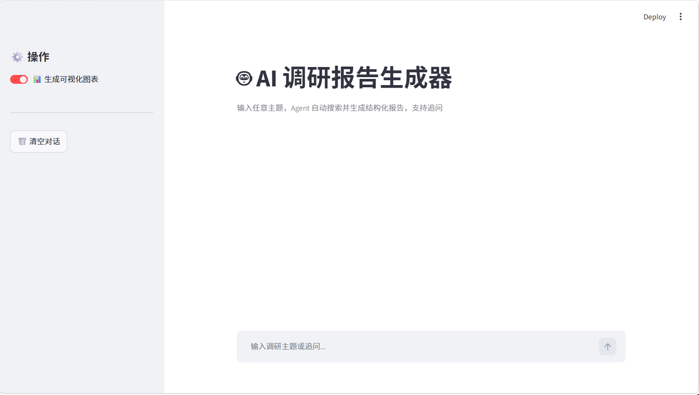
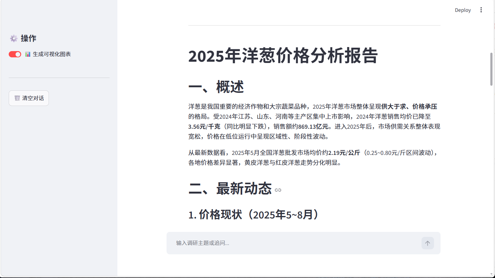
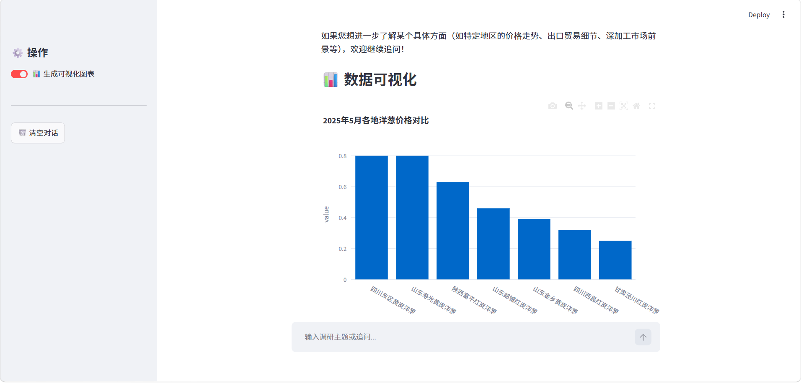
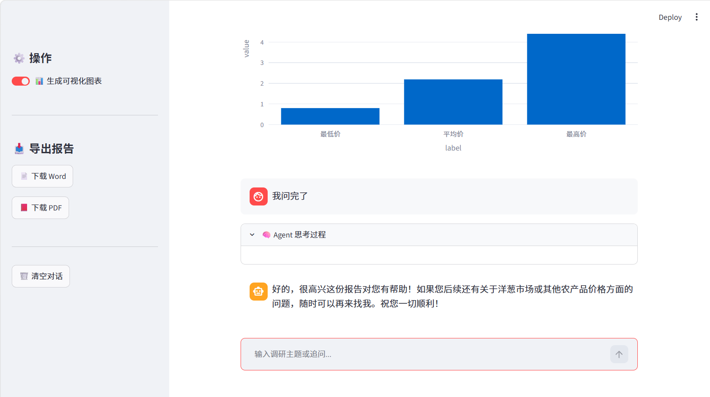

# 🤖 AI 调研报告生成器

> 基于 AI Agent 架构构建的智能调研系统，输入任意主题，自动搜索网络信息并生成结构化报告，支持追问、数据可视化与多格式导出。

## 项目背景

传统调研需要人工搜索、筛选、整理信息，耗时耗力。本项目基于 AI Agent 架构，让大模型自主决定搜索策略、调用搜索工具、整合信息并生成报告，将调研过程全面自动化。与普通问答不同，Agent 能够多轮调用工具、自主规划执行步骤，真正实现"一句话生成专业报告"。

## 功能特点

- 🔍 Agent 自动多轮搜索，实时展示思考过程
- 📋 生成包含概述、最新动态、主要观点、总结的结构化报告
- 💬 支持追问，记忆对话上下文
- 📊 自动从报告中提取数据，生成饼图、柱状图等可视化图表
- 📥 支持一键导出 Word 和 PDF 格式报告
- 🗑️ 支持一键清空对话

## 技术栈

| 模块 | 技术 |
|------|------|
| 大语言模型 | DeepSeek API（兼容 OpenAI 接口）|
| 搜索工具 | Tavily Search API |
| Agent 框架 | Function Calling（工具调用）|
| 数据可视化 | Plotly |
| 报告导出 | python-docx、ReportLab |
| 前端界面 | Streamlit |

## 系统架构与实现原理


用户输入调研主题
↓
Agent 分析任务，决定搜索策略
↓
调用 Tavily 搜索工具（可多轮）
↓
整合搜索结果，生成结构化报告
↓
提取报告数据，生成可视化图表
↓
支持用户追问，记忆对话上下文


**为什么用 Function Calling 而不是普通 Prompt？**

Function Calling 让模型能够主动决定"何时调用工具、调用什么工具、输入什么参数"，而不是被动回答问题。模型会根据任务复杂度自主决定搜索次数和关键词，实现真正的自主规划。

## 快速开始

### 环境要求

- Python 3.9+
- DeepSeek API Key（[申请地址](https://platform.deepseek.com/)）
- Tavily API Key（[申请地址](https://tavily.com/)）
- 需要开启 VPN（Tavily 为国外服务）

### 1. 克隆项目

```bash
git clone https://github.com/你的用户名/agent-research.git
cd agent-research
```


2. 安装依赖

pip install streamlit openai tavily-python plotly pandas python-docx reportlab


3. 配置 API Key

在 app.py 中填入你的 API Key：

tavily_api_key="你的Tavily API Key"
api_key="你的DeepSeek API Key"


4. 启动应用

streamlit run app.py


## 项目截图

### 主页界面


### Agent 思考过程


### 调研报告


### 可视化图表


### 追问与导出



未来计划

	•	支持自定义报告模板
	•	增加报告历史记录，可查看过往调研
	•	支持导出 PPT 格式
	•	接入更多搜索源（学术论文、社交媒体）
	•	增加报告质量评分功能

作者

谭诗语 | shiyut88@gmail.com


---
