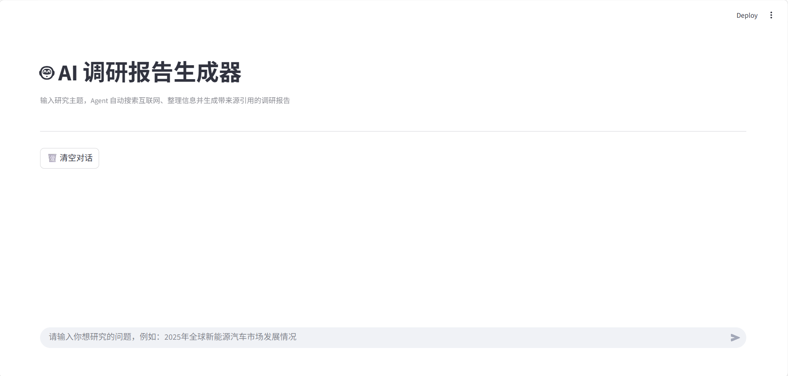
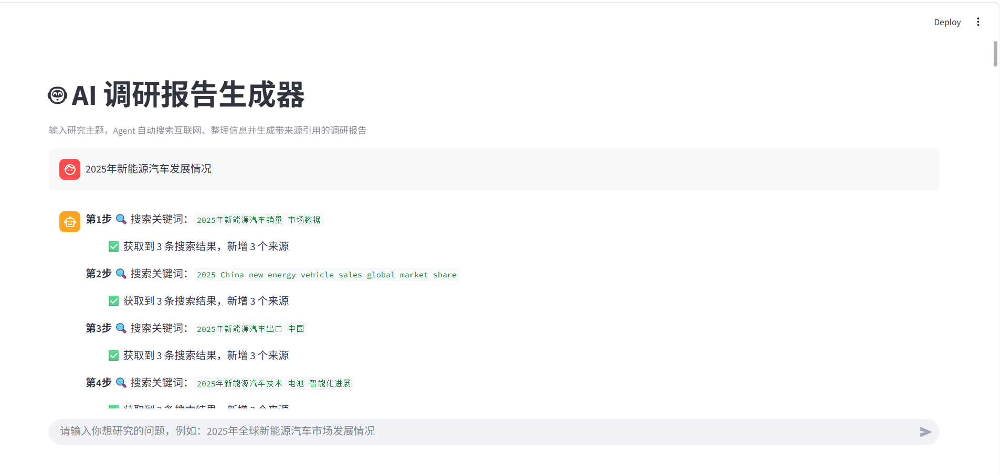
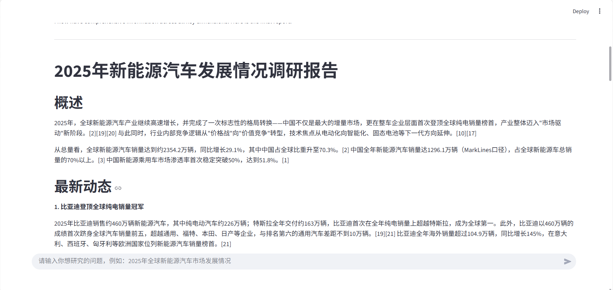
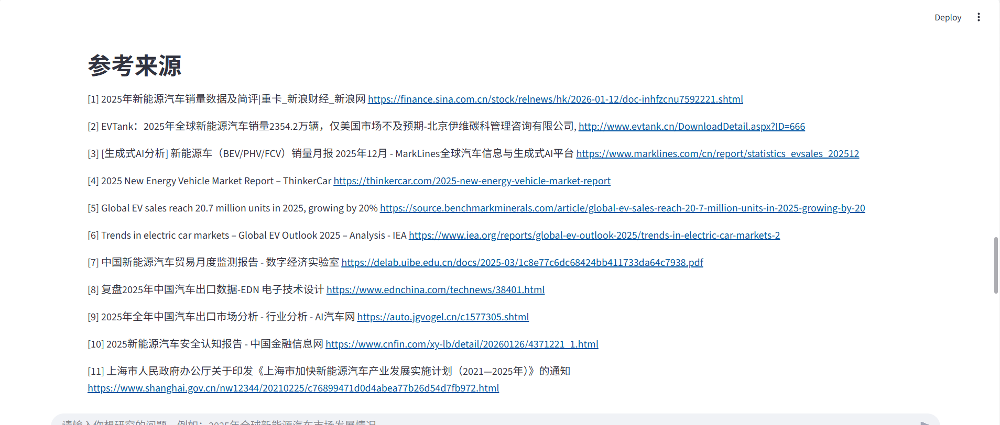
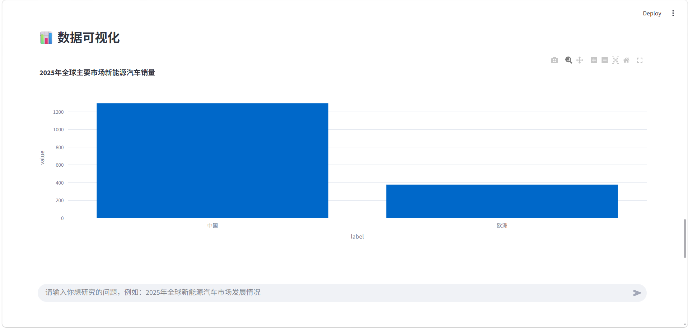
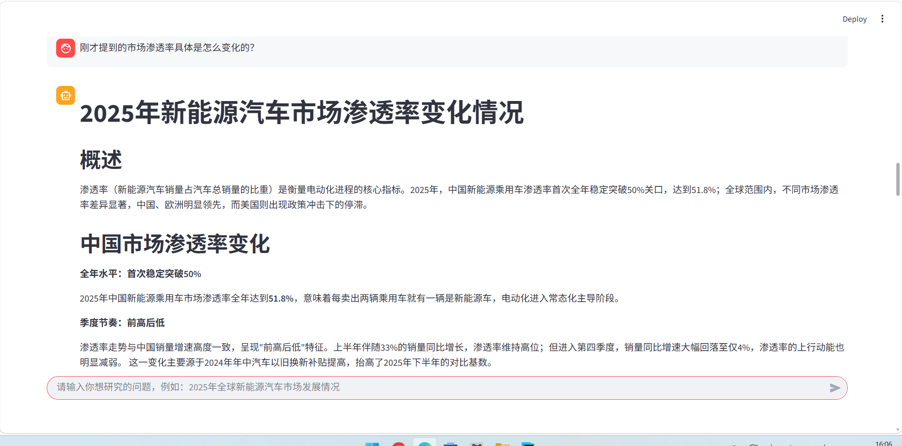
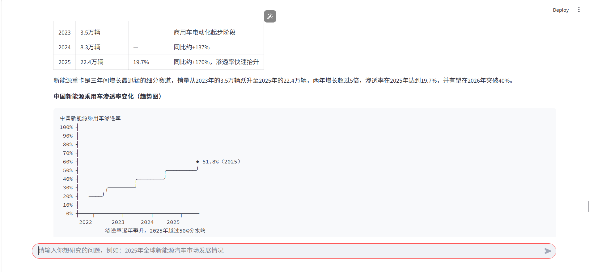
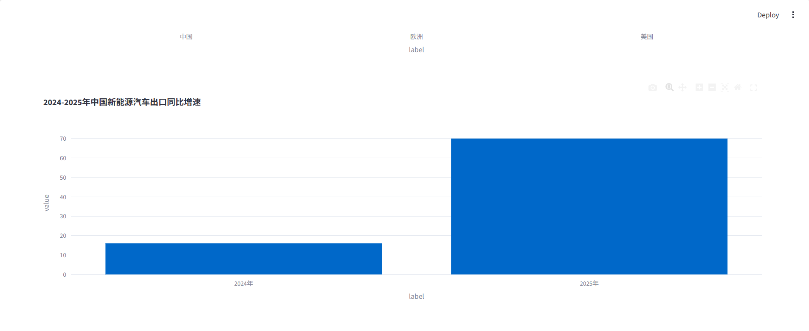
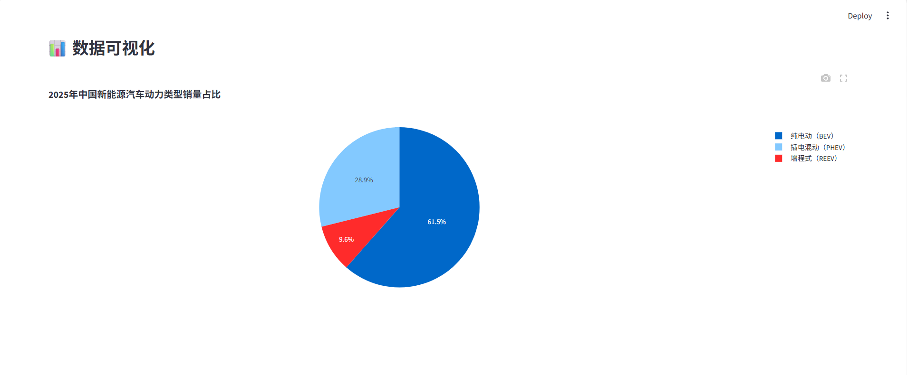
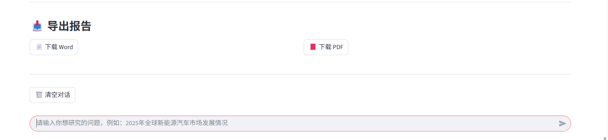

# 🤖 AI 调研报告智能体

一个基于 **DeepSeek、Tavily 和 Streamlit** 构建的 AI 调研报告智能体。用户输入研究问题后，系统可以搜索互联网资料、整合多来源信息并生成结构化调研报告，同时支持来源追踪、Citation 校验、多轮追问、数据可视化，以及 Word / PDF 导出。

## 项目展示

### 1. 项目首页



### 2. 输入问题与整理搜索关键词



### 3. 自动生成调研报告



### 4. 参考来源与 Citation

系统记录调研中使用的网页来源，并对报告中的引用进行校验，便于追溯信息来源。



### 5. 报告数据可视化



### 6. 多轮追问



### 7. 图表分析



### 8. 柱状图示例



### 9. 饼图示例



### 10. Word / PDF 导出



## 核心功能

- **AI Agent 调研**：根据研究问题调用 Tavily 搜索工具，获取网络资料并整理信息。
- **报告生成**：综合搜索结果，生成结构化中文调研报告。
- **来源追踪与 Citation 校验**：记录参考来源并检查报告中的引用。
- **数据提取与可视化**：提取报告中的结构化数据，并使用 Plotly 生成柱状图或饼图。
- **多轮对话**：支持围绕已有调研结果继续追问。
- **报告导出**：支持导出 Word 和 PDF 文件。

## 技术栈

- **Python**、**Streamlit**：项目开发与 Web 界面
- **DeepSeek**、**OpenAI SDK**：大模型调用与报告生成
- **Tavily**：互联网搜索
- **Pandas**、**Plotly**：数据处理与可视化
- **python-docx**、**FPDF**：Word / PDF 报告生成

## 运行项目

安装依赖：

```bash
pip install -r requirements.txt
```

启动应用：

```bash
streamlit run app.py
```

## 项目亮点

项目将大模型、搜索工具、来源管理和数据可视化整合为完整的调研流程，实现从**研究问题输入、网络资料检索、报告生成，到图表展示与文件导出**的应用闭环。
